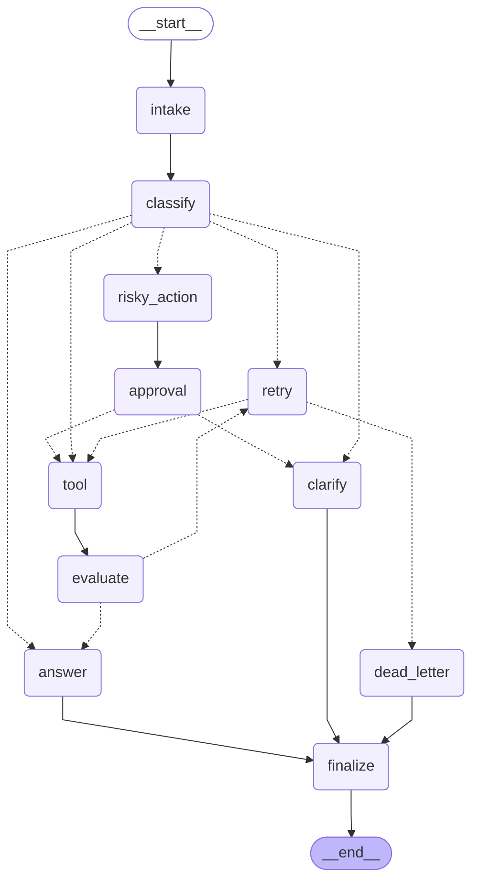

# Day 08 Lab Report

## 1. Summary

| Metric | Value |
|---|---:|
| Total scenarios | 7 |
| Success rate | 100.0% |
| Average nodes visited | 6.43 |
| Total retries | 3 |
| Total interrupts | 2 |
| Resume/state-history evidence | Yes |

## 2. Architecture

The workflow is `START → intake → classify`, followed by conditional routing:

- `simple → answer → finalize → END`.
- `tool → evaluate`; successful results go to `answer`, while failed results go
  through the bounded retry loop.
- `missing_info → clarify → finalize → END`.
- `risky → risky_action → approval`; only approved actions continue to `tool`.
- `error → retry`; exhausted retries go to `dead_letter → finalize → END`.

All nodes return partial state updates. Append-only fields (`messages`,
`tool_results`, `errors`, and `events`) use the `add` reducer. Current-value
fields such as `route`, `attempt`, `evaluation_result`, `approval`, and
`final_answer` overwrite the previous value.

## 3. Scenario results

| Scenario | Expected route | Actual route | Success | Retries | Interrupts |
|---|---|---|---:|---:|---:|
| S01_simple | simple | simple | ✅ | 0 | 0 |
| S02_tool | tool | tool | ✅ | 0 | 0 |
| S03_missing | missing_info | missing_info | ✅ | 0 | 0 |
| S04_risky | risky | risky | ✅ | 0 | 1 |
| S05_error | error | error | ✅ | 2 | 0 |
| S06_delete | risky | risky | ✅ | 0 | 1 |
| S07_dead_letter | error | error | ✅ | 1 | 0 |

## 4. Failure analysis

1. **Transient tool failure:** results containing `ERROR` are evaluated as
   `needs_retry`. The retry node increments `attempt`; `route_after_retry`
   sends the run back to `tool` only while `attempt < max_attempts`, otherwise
   it uses `dead_letter`.
2. **Risky action without approval:** refund, deletion, cancellation, email
   sending, and similar side effects are routed through `approval`. A rejected
   decision goes to clarification and never reaches the action tool.

Recorded errors:

- **S05_error**: retry 1/3: classified or transient failure; retry 2/3: ERROR: transient tool failure on attempt 1
- **S07_dead_letter**: retry 1/1: classified or transient failure

## 5. Persistence / recovery evidence

Each invocation uses a unique `thread_id` (`thread-<scenario_id>`). The
configured checkpointer is passed to `graph.compile()`. `resume_success` is set
only when a state-history checkpoint is observed after execution; this keeps
the metric tied to evidence rather than a claim.

## 6. LLM integration

`classify_node` calls the configured chat model with structured output for one
of `simple`, `tool`, `missing_info`, `risky`, or `error`. `answer_node` generates
a grounded response from the original query, tool results, and approval
context. The configured OpenAI model is `gpt-5.6-sol` when `LLM_MODEL` is not
overridden.

## 7. Extensions

Three bonus extensions are implemented and evidenced:

1. **Real HITL interrupt/resume.** When `LANGGRAPH_INTERRUPT=true`,
   `approval_node` calls `langgraph.types.interrupt()` instead of the mock
   auto-approval. The graph pauses before any risky side effect executes and is
   resumed with `Command(resume=...)`. Covered end-to-end by
   `tests/test_hitl_interrupt.py` (pause, resume-approve, resume-reject).
2. **SQLite persistence with state-history replay.** The `sqlite` checkpointer
   (`checkpoints.db`, WAL mode) records every run under its own `thread_id`;
   `resume_success` above is only set when `get_state_history()` actually
   returns checkpoints after execution.
3. **Graph diagram export.** `python -m langgraph_agent_lab.cli diagram` renders
   the compiled graph to Mermaid (`outputs/graph_diagram.md`):

## 8. Improvement plan

- Replace the mock tool with authenticated, idempotent tool adapters.
- Persist approval decisions and add reviewer identity/audit retention controls.
- Add evaluator traces, token/cost metrics, and hidden-scenario regression tests.
- Use real interrupt/resume UI for human approval in production.
